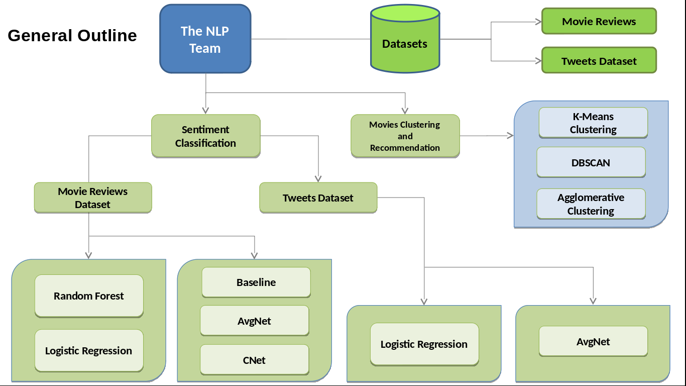

# Sentiment-Analysis-NLP-Approach

The goal of this project is as follows:

1) **Binary and multi-class sentiment analysis** and 

2) **Movie Recommendation system**.

This readme first goes through the sentiment analysis part, followed by discussion on recommendation system in the second part. Overall outline of the project is given as follows:

